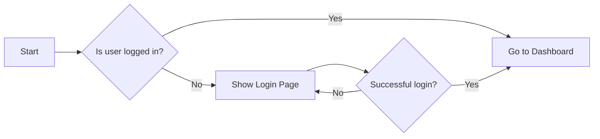

# Notion Style Theme

> This is a sample document demonstrating the **Notin Style Theme** for Typora.

---

**Inline styles:**

**strong**, _Emphasis_, `code`, <u>underline</u>, ~~strikethrough~~,$ \LaTeX $, H$\_2$O, ==highlight==, [Link](#)

---

**Image:**


---

**Headings:**

# Heading1

## Heading2

### Heading3

#### Heading4

##### Heading5

###### Heading6

---

**Quote:**

> Blockquote: "This is a quote."
>
> > Nested Blockquote: "This is a quote inside a quote."

---

**Code Block:**

```python
#  Notin Style Theme - Sample Code
def hello():
    print("Hello, Notin Style Theme!")
```

---

**Alerts:**

> [!NOTE]
>
> This is a note block.

> [!TIP]
>
> This is a tip block.

> [!IMPORTANT]
>
> This is an important block.

> [!WARNING]
>
> This is a warning block.

> [!CAUTION]
>
> This is a caution block.

---

**Unordered List:**

- Item 1
  - Subitem 1.1
  - Subitem 1.2
  - Subitem 1.3
    - Sub-subitem 1.3.1
    - Sub-subitem 1.3.2
    - Sub-subitem 1.3.3
- Item2
- Item3

---

**Ordered List:**

1. First item
   1. Subitem 1.a
   2. Subitem 1.b
   3. Subitem 1.c
      1. Sub-subitem 1.c.i
      1. Sub-subitem 1.c.ii
      1. Sub-subitem 1.c.iii
2. Second item
3. Third item

---

**To-Do List:**

- [ ] Task 1
- [x] Completed Task
- [ ] Task 2

---

**Table:**

| Column 1 | Column 2 | Column 3 |
| -------- | -------- | -------- |
| Row 1    | Data 1   | Data 2   |
| Row 2    | Data 3   | Data 4   |

---

**Math Block:**

$$
\mathcal{F}(f)(\xi) = \int_{-\infty}^{\infty} f(x) e^{-2\pi i x \xi} dx
$$

---

**Mermeid:**



---

**Footnotes:**

This is an examle of a footnote reference[^1].

[^1]: This is the footnote text.

---

**Toc:**

[toc]

---

Enjoy using the **Notin Style Theme** for Typora!
